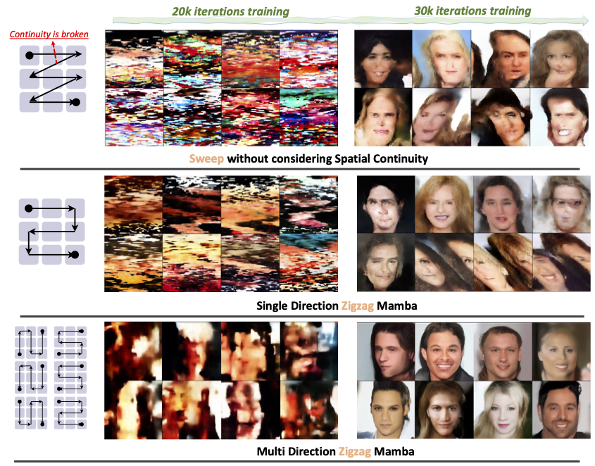

#  ZigMa: A DiT-style Zigzag Mamba Diffusion Model

**Arxiv**

This repository represents the official implementation of the paper titled "ZigMa: A DiT-style Zigzag Mamba Diffusion Model".

[](https://taohu.me/zigma)
[](https://arxiv.orgg)
[](https://huggingface.co/taohu/zigma_faceshq1024)
[](https://github.com/CompVis/zigma)
[](https://www.apache.org/licenses/LICENSE-2.0)


[Vincent Tao Hu](http://taohu.me),
[Stefan Andreas Baumann](https://scholar.google.de/citations?user=egzbdnoAAAAJ&hl=en),
[Ming Gui](https://www.linkedin.com/in/ming-gui-87b76a16b/?originalSubdomain=de),
[Olga Grebenkova](https://www.linkedin.com/in/grebenkovao/),
[Pingchuan Ma](https://www.linkedin.com/in/pingchuan-ma-492543156/),
[Johannes Fischer](https://www.linkedin.com/in/js-fischer/ ),
[Bjorn Ommer](https://ommer-lab.com/people/ommer/ )

We present ZigMa, a scanning scheme that follows a zigzag pattern, considering both spatial continuity and parameter efficiency. We further adapt this scheme to video, separating the reasoning between spatial and temporal dimensions, thus achieving efficient parameter utilization. Our design allows for greater incorporation of inductive bias for non-1D data and improves parameter efficiency in diffusion models.




## 🎓 Citation

Please cite our paper:

```bibtex
@InProceedings{hu2024zigma,
      title={ZigMa: A DiT-style Zigzag Mamba Diffusion Model},
      author={Vincent Tao Hu and Stefan Andreas Baumann and Ming Gui and Olga Grebenkova and Pingchuan Ma and Johannes Fischer and Bjorn Ommer},
      booktitle = {Arxiv},
      year={2024}
}
```


## :white_check_mark: Updates
* **` April. 2th, 2024`**: Main code released.


## 🚀  Training


#### CelebaMM256 


Sweep-2, 1GPU
```bash
accelerate launch  --num_processes 1 --num_machines 1  --mixed_precision fp16    train_acc.py  model=sweep2_b1  use_latent=1   data=celebamm256_uncond  ckpt_every=10_000 data.sample_fid_n=5_000 data.sample_fid_bs=4 data.sample_fid_every=10_000  data.batch_size=8   note=_ 
```

Zigzag-8, 1GPU
```bash
CUDA_VISIBLE_DEVICES=4 accelerate launch  --num_processes 1 --num_machines 1  --mixed_precision fp16  --main_process_ip 127.0.0.1 --main_process_port 8868  train_acc.py  model=zigzag8_b1  use_latent=1   data=celebamm256_uncond  ckpt_every=10_000 data.sample_fid_n=5_000 data.sample_fid_bs=4 data.sample_fid_every=10_000  data.batch_size=4   note=_ 
```


####  UCF101

Baseline, multi-GPU
```bash
CUDA_VISIBLE_DEVICES="0,1,2,3" accelerate launch  --num_processes 4 --num_machines 1 --multi_gpu --mixed_precision fp16  --main_process_ip 127.0.0.1 --main_process_port 8868  train_acc.py  model=3d_sweep2_b2  use_latent=1 data=ucf101  ckpt_every=10_000  data.sample_fid_n=20_0 data.sample_fid_bs=4 data.sample_fid_every=10_000  data.batch_size=4   note=_ 
```

Factorized 3D Zigzag: sst, multi-GPU
```bash
CUDA_VISIBLE_DEVICES="0,1,2,3" accelerate launch  --num_processes 4 --num_machines 1 --multi_gpu --mixed_precision fp16  --main_process_ip 127.0.0.1 --main_process_port 8868  train_acc.py  model=3d_zigzag8sst_b2  use_latent=1 data=ucf101  ckpt_every=10_000  data.sample_fid_n=20_0 data.sample_fid_bs=4 data.sample_fid_every=10_000  data.batch_size=4   note=_ 
```


## 🚀 Sampling


#### FacesHQ 1024

1GPU
```bash
CUDA_VISIBLE_DEVICES="2" accelerate launch  --num_processes 1 --num_machines 1 --mixed_precision fp16    sample_acc.py  model=zigzag8_b2_s128  use_latent=1   data=facehq_1024  ckpt_every=10_000 data.sample_fid_n=5_000 data.sample_fid_bs=4 data.sample_fid_every=10_000  data.batch_size=8  sample_mode=ODE likelihood=0  num_fid_samples=5_000 sample_debug=0  ckpt=checkpoints/faceshq1024_0060000.pt  
```

##  🛠️  Environment Preparation

cuda==11.8,python==3.12.1, torch==2.2.0

```bash
conda create -n zigma python=3.12
conda activate zigma
conda install -c "nvidia/label/cuda-11.8.0" cuda-toolkit
conda install pytorch torchvision  pytorch-cuda=11.8 -c pytorch -c nvidia
pip install  torchdiffeq  matplotlib h5py timm diffusers accelerate loguru blobfile ml_collections
pip install hydra-core opencv-python torch-fidelity webdataset einops pytorch_lightning
pip install torchmetrics --upgrade
pip install opencv-python causal-conv1d
cd dis_causal_conv1d && pip install -e . && cd ..
cd dis_mamba && pip install -e . && cd ..
pip install moviepy imageio #wandb.Video() need it
pip install  scikit-learn --upgrade 
pip install transformers==4.36.2
pip install numpy-hilbert-curve # (optional) for generating the hilbert path
pip install av    # (optional)  to use the ucf101 frame extracting
pip install -v -U git+https://github.com/facebookresearch/xformers.git@main#egg=xformers  #for FDD metrics
```


Create a file under the directory wandb/default.yaml:
```yaml
key: YOUR_WANDB_KEY
entity: YOUR_ENTITY
project: YOUR_PROJECT_NAME
```

## Q&A

- If you meeet some issues for installing ssm, maybe you can find solution here: [https://github.com/state-spaces/mamba/issues](https://github.com/state-spaces/mamba/issues)

## 📷  Dataset Preparation

FacesHQ

UCF101


## Trend

[](https://star-history.com/#CompVis/zigma&Date)


## 🎫 License

This work is licensed under the Apache License, Version 2.0 (as defined in the [LICENSE](LICENSE.txt)).

By downloading and using the code and model you agree to the terms in the  [LICENSE](LICENSE.txt).

[](https://www.apache.org/licenses/LICENSE-2.0)
