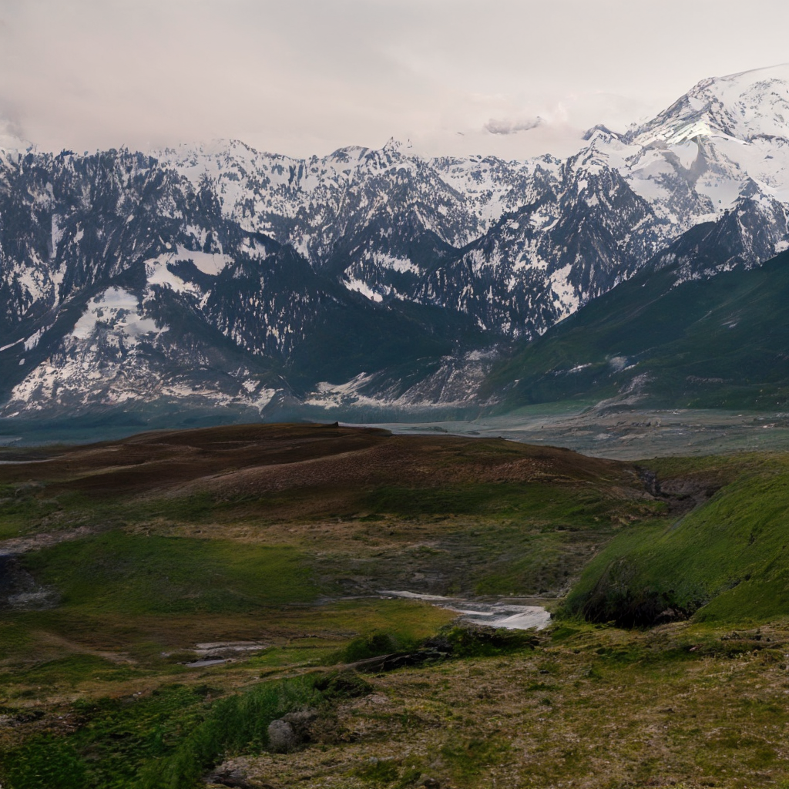

#  ZigMa: A DiT-style Zigzag Mamba Diffusion Model (ECCV 2024)

**Arxiv**

This repository represents the official implementation of the paper titled "ZigMa: A DiT-style Zigzag Mamba Diffusion Model (ECCV 2024)".

[](https://taohu.me/zigma)
[](https://arxiv.org/abs/2403.13802)
[](https://huggingface.co/taohu/zigma)
[](https://github.com/CompVis/zigma)
[](https://github.com/CompVis/zigma/issues?q=is%3Aissue+is%3Aclosed) 
[](https://twitter.com/_akhaliq/status/1770668624392421512)
[](https://www.apache.org/licenses/LICENSE-2.0)


[Vincent Tao Hu](http://taohu.me),
[Stefan Andreas Baumann](https://scholar.google.de/citations?user=egzbdnoAAAAJ&hl=en),
[Ming Gui](https://www.linkedin.com/in/ming-gui-87b76a16b/?originalSubdomain=de),
[Olga Grebenkova](https://www.linkedin.com/in/grebenkovao/),
[Pingchuan Ma](https://www.linkedin.com/in/pingchuan-ma-492543156/),
[Johannes Fischer](https://www.linkedin.com/in/js-fischer/ ),
[Björn Ommer](https://ommer-lab.com/people/ommer/ )

We present ZigMa, a scanning scheme that follows a zigzag pattern, considering both spatial continuity and parameter efficiency. We further adapt this scheme to video, separating the reasoning between spatial and temporal dimensions, thus achieving efficient parameter utilization. Our design allows for greater incorporation of inductive bias for non-1D data and improves parameter efficiency in diffusion models.


## 🎓 Citation

Please cite our paper:

```bibtex
@InProceedings{hu2024zigmav2,
      title={Exploring Mamba-based Diffusion: Towards better Rotation Invariance and Scan Aggregation},
      author={Vincent Tao Hu and Felix Krause and Ming Gui and Kim-Louis Simmoteit and Johannes S. Fischer and  Björn Ommer},
      booktitle = {Arxiv},
      year={2024}
}
@InProceedings{hu2024zigma,
      title={ZigMa: A DiT-style Zigzag Mamba Diffusion Model},
      author={Vincent Tao Hu and Stefan Andreas Baumann and Ming Gui and Olga Grebenkova and Pingchuan Ma and Johannes Fischer and Björn Ommer},
      booktitle = {ECCV},
      year={2024}
}
```

## :white_check_mark: Updates
*  **` June. 14th, 2024`**:  🚀🚀🚀 An extension of zigma, [Exploring Mamba-based Diffusion: Towards better
Rotation Invariance and Scan Aggregation](https://drive.google.com/file/d/1dbS9dgNJHySC6DE-2fcWOkGuTiMLmHtf/view?usp=sharing) is released on the repo.
* **` May. 24th, 2024`**:  🚀🚀🚀 New checkpoints for FacesHQ1024, landscape1024, Churches256 datasets.
* **` April. 6th, 2024`**: Support for FP16 training, and checkpoint function, and torch.compile to achieve better memory utilization and speed boosting.
* **` April. 2th, 2024`**: Main code released.





## Quick Demo


```python
from model_zigma import ZigMa

img_dim = 32
in_channels = 3

model = ZigMa(
in_channels=in_channels,
embed_dim=640,
depth=18,
img_dim=img_dim,
patch_size=1,
has_text=True,
d_context=768,
n_context_token=77,
device="cuda",
scan_type="zigzagN8",
use_pe=2,
)

x = torch.rand(10, in_channels, img_dim, img_dim).to("cuda")
t = torch.rand(10).to("cuda")
_context = torch.rand(10, 77, 768).to("cuda")
o = model(x, t, y=_context)
print(o.shape)
```


### Improved Training Performance
In comparison to the original implementation, we implement a selection of training speed acceleration and memory saving features including gradient checkpointing
| torch.compile | gradient checkpointing | training speed | memory |
| :-----------: | :--------------------: | :------------: | :----: |
|       ❌       |           ❌            | 1.05 iters/sec |  18G   |
|       ❌       |           ✔            | 0.93 steps/sec |   9G   |
|       ✔       |           ❌            | 1.8 iters/sec  |  18G   |

torch.compiles is for indexing operation: [here](https://github.com/CompVis/zigma/blob/1e78944ebce400d34a12efd4baba1daad0fae9f3/dis_mamba/mamba_ssm/modules/mamba_simple.py#L55) and [here](https://github.com/CompVis/zigma/blob/1e78944ebce400d34a12efd4baba1daad0fae9f3/dis_mamba/mamba_ssm/modules/mamba_simple.py#L60)


## 🚀  Training


#### CelebaMM256 


Sweep-2, 1GPU
```bash
accelerate launch  --num_processes 1 --num_machines 1  --mixed_precision fp16    train_acc.py  model=sweep2_b1  use_latent=1   data=celebamm256_uncond  ckpt_every=10_000 data.sample_fid_n=5_000 data.sample_fid_bs=4 data.sample_fid_every=10_000  data.batch_size=8   note=_ 
```

Zigzag-8, 1GPU
```bash
CUDA_VISIBLE_DEVICES=4 accelerate launch  --num_processes 1 --num_machines 1  --mixed_precision fp16  --main_process_ip 127.0.0.1 --main_process_port 8868  train_acc.py  model=zigzag8_b1  use_latent=1   data=celebamm256_uncond  ckpt_every=10_000 data.sample_fid_n=5_000 data.sample_fid_bs=4 data.sample_fid_every=10_000  data.batch_size=4   note=_ 
```


####  UCF101

Baseline, multi-GPU
```bash
CUDA_VISIBLE_DEVICES="0,1,2,3" accelerate launch  --num_processes 4 --num_machines 1 --multi_gpu --mixed_precision fp16  --main_process_ip 127.0.0.1 --main_process_port 8868  train_acc.py  model=3d_sweep2_b2  use_latent=1 data=ucf101  ckpt_every=10_000  data.sample_fid_n=20_0 data.sample_fid_bs=4 data.sample_fid_every=10_000  data.batch_size=4   note=_ 
```

Factorized 3D Zigzag: sst, multi-GPU
```bash
CUDA_VISIBLE_DEVICES="0,1,2,3" accelerate launch  --num_processes 4 --num_machines 1 --multi_gpu --mixed_precision fp16  --main_process_ip 127.0.0.1 --main_process_port 8868  train_acc.py  model=3d_zigzag8sst_b2  use_latent=1 data=ucf101  ckpt_every=10_000  data.sample_fid_n=20_0 data.sample_fid_bs=4 data.sample_fid_every=10_000  data.batch_size=4   note=_ 
```


## 🚀 Sampling


#### FacesHQ 1024

You can directly download the model in this repository. You also can download the model in python script:
```python
from huggingface_hub import hf_hub_download

hf_hub_download(
        repo_id="taohu/zigma",
        filename="faceshq1024_0090000.pt",
        local_dir="./checkpoints",
    )
```
[huggingface model repo](https://huggingface.co/taohu/zigma)

|Dataset | Checkingpoint|Model |data|
|---|---|---|---|
|faceshq1024.pt|faceshq1024_0090000.pt|model=s1024_zigzag8_b2_old|data=facehq_1024|
|landscape1024|landscape1024_0210000.pt|model=s1024_zigzag8_b2_old|data=landscapehq_1024|
|Churches256|churches256_0280000.pt|model=zigzag8_b1_pe2|data=churches256|
|Coco256|zigzagN8_b1_pe2_coco14_bs48_0400000.pt|mode=zigzag8_b1_pe2|data=coco14 (31.0) | 


1GPU sampling 
```bash
CUDA_VISIBLE_DEVICES="2" accelerate launch  --num_processes 1 --num_machines 1     sample_acc.py  model=s1024_zigzag8_b2_old  use_latent=1   data=facehq_1024  ckpt_every=10_000 data.sample_fid_n=5_000 data.sample_fid_bs=4 data.sample_fid_every=10_000  data.batch_size=8  sample_mode=ODE likelihood=0  num_fid_samples=5_000 sample_debug=0  ckpt=checkpoints/faceshq1024_0060000.pt  
```
The sampled images will be saved both on wandb (disable with `use_wandb=False`) and directory **samples/**


##  🛠️  Environment Preparation


cuda==11.8,python==3.11, torch==2.2.0, gcc==11.3(for SSM enviroment)

python=3.11 # support the torch.compile for the time being. https://github.com/pytorch/pytorch/issues/120233#issuecomment-2041472137
```bash
conda create -n zigma python=3.11
conda activate zigma
conda install -c "nvidia/label/cuda-11.8.0" cuda-toolkit
conda install pytorch torchvision  pytorch-cuda=11.8 -c pytorch -c nvidia
pip install  torchdiffeq  matplotlib h5py timm diffusers accelerate loguru blobfile ml_collections wandb
pip install hydra-core opencv-python torch-fidelity webdataset einops pytorch_lightning
pip install torchmetrics --upgrade
pip install opencv-python causal-conv1d
cd dis_causal_conv1d && pip install -e . && cd ..
cd dis_mamba && pip install -e . && cd ..
pip install moviepy imageio #wandb.Video() need it
pip install  scikit-learn --upgrade 
pip install transformers==4.36.2
pip install numpy-hilbert-curve # (optional) for generating the hilbert path
pip install av    # (optional)  to use the ucf101 frame extracting
pip install -v -U git+https://github.com/facebookresearch/xformers.git@main#egg=xformers  #for FDD metrics
```

Installing Mamba may cost a lot of effort. If you encounter problems, this [issues in Mamba](https://github.com/state-spaces/mamba/issues) may be very helpful.


Create a file under the directory ./config/wandb/default.yaml:

```yaml
key: YOUR_WANDB_KEY
entity: YOUR_ENTITY
project: YOUR_PROJECT_NAME
```

## Q&A

- If you meeet some issues for installing ssm, maybe you can find solution here: [https://github.com/state-spaces/mamba/issues](https://github.com/state-spaces/mamba/issues)

## 📷  Dataset Preparation


Due to privacy issue, we cannot share the dataset here, basically, we use MM-CelebA-HQ-Dataset from [https://github.com/IIGROUP/MM-CelebA-HQ-Dataset](https://github.com/IIGROUP/MM-CelebA-HQ-Dataset), we organize into the format of [webdataset](https://webdataset.github.io/) to enable the scalable training in multi-gpu.


Webdataset Format: 
- image: image.jpg # ranging from [-1,1], shape should be [3,256,256]
- latent: img_feature256.npy # latent feature for latent generation, shape should be [4,32,32]


The dataset we use include:
- MM-CelebA-HQ for 256 and 512 resolution training 
- FacesHQ1024 for 1024 resolution
- UCF101 for 16x256x256 resolution


## Trend

[](https://star-history.com/#CompVis/zigma&Date)


## 🎫 License

This work is licensed under the Apache License, Version 2.0 (as defined in the [LICENSE](LICENSE.txt)).

By downloading and using the code and model you agree to the terms in the  [LICENSE](LICENSE.txt).

[](https://www.apache.org/licenses/LICENSE-2.0)
